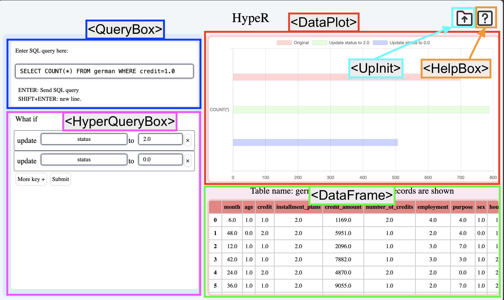

# Development Documentation

# Overview

In this project, we implemented 

1. A user interface (front-end) for a relational database that does “what-if” analysis, and
2. Several backend APIs, integrated into the existing code base that handle RESTful requests from the front-end

# Code

Front-end: https://github.com/bentondecusin/hyper-frontend

Back-end: https://github.com/bentondecusin/Hyper-Code

# See also:

- **Website Usage appendix**

# Front-end Implementation

The front end is based on Next.js, an invariant of React.js but does server-side rendering, and is primarily written in TypeScript. However, future implementation may use JavaScript, which requires less type-checking than TypeScript. 

## npm packages used

- Chart.js (a tool for plotting charts)
- Tailwindcss (a CSS framework that allows users to specify styles in an HTML tag’s class name)
- SweetAlarm2 (a nice tool that displays errors to the user (e.g. Invalid SQL: syntax)

## App & Components

A website is said to be an app that consists of several components. Next.js will smartly render certain components instead of re-rendering everything. One can write an HTML tag as a function call. 

For instance,

```html
 <Dataframe ...>
		...
 </Dataframe>
```

is generated from a function call `Dataframe(...)`

In this way, user can implement each components as needed. More detailed information on Next.js can be found here. 

There are 6 components present in this app: `DataFrame`, `QueryBox`, `DataPlot`, `HyperQueryBox`, `UpInit`, `HelpBox`. An overview is shown below




### `<HelpBox>...` : Provides instruction

When user clicks help button, 


a help window will be displayed. This window disappear if closed


### `<UpInit>...` : Provides a space for user to upload file

When the user lands on the website, or when user clicks upload button,


an upload window will be displayed. This window disappear if closed.


When the user uploads some file, front-end will check if the file is csv or txt. If so, a RESTful request call will be fired, calling `api/upload_csv` , with the file in the request payload

### `<DataFrame>...` : A place that preview the csv file

Upon a successful csv/txt file upload, first 200 records of the dataset will be shown. For example, when ‘german.csv’ is uploaded, image below will be displayed 


Note that number of preview lines and the table style can be modified on backend

### `<QueryBox>...` : Provides a input for running read-only SQL queries

Upon a successful csv/txt file upload, the frond-end will allow the user to run `SELECT COUNT` or `SELECT AVG` queries. For example, when ‘german.csv’ is uploaded, `QueryBox` will be displayed 


Then the user can run `SELECT COUNT` or `SELECT AVG` . 

When the user enter the result, the frond-end will parse the query, and examines if it

- is grammatically correct
- has 1 where clause
- 1 COUNT or 1 AVG
- table name is same as the file name
- is SELECT query

If these conditions are met, the front-end will extract informations such as `AT`, `q_type`, `c`

, `postlst` , `postvallst`

Then a RESTful request call will be fired, calling `api/SQL`

If it’s valid, backend will give a chart.js configuration and `DataPlot` component will be rendered/refreshed

Note: This version only supports single column result, and 1 single where clause. Furture development may lift this constraint, but need to coordinate with the backend.

### `<DataPlot>...`: Display the SQL query result

Upon a successful SQL query, the frond-end will display the query result.

For example, when the user runs `SELECT COUNT(*) FROM german WHERE credit=1.0`, a chart will be displayed 


### `<HyperQueryBox>...` : Provides a input for running what-if queries

Upon a successful SQL query, the frond-end will allow the user to run what-if analysis.


User can add or remove field. Each field will yield a separate result.

When the user click submit, a RESTful request call will be fired, calling `api/whatif_qry`

If it’s valid, backend will give a chart.js configuration and `DataPlot` component will be updated


### The overview of rendering is shown below


## Note on chart.js

Chart.js is a node package that allows the user to visual data. What you need to provide is a chart configuration, which contains chart dataset. See more [here](https://react-chartjs-2.js.org/)

Whenever the configuration, the plot will be updated.

**Note**: In this project, we visualize numerical data as horizontal bar. Future development may adjust the styles or change the display styles (e.g. vertical bar)

# Back-end Implementation

The front end is based on Flask, a server package that can handle RESTful API calls, written in python. The backend  exposes 3 APIs. 

### `/api/upload_csv` : accepts an csv file and stores as pd.DataFrame

When a csv is uploaded to front end, backend will 

1. attempt to store it in a DataFrame, named `df`
2. Create an in-memory sqlite3 connection, named `conn`, to handle SQL queries

**If successful, return:**

- staus code 200
- A preview of data frame (fist 200 records), in HTML literal, stored in `data` field of response
- A  of data frame (fist 200 records), in HTML literal, stored in `data` field of response

**If unsuccessful, return:**

- staus code 404
- error messages

### `/api/SQL` : runs read-only query and return plotting data

Such running SQL must only return a 1x1 data frame. This data point will be transformed into a chart.js data set, and then a chart.js plotting configuration. That is

**SQL result → chart.js dataset → chart.js configuration**

Note: This constraints may be lifted for future development. One need to specify what to display in the data plot. For exmple, if we assume there is only a 1x1 data frame, we can just display a single bar. 

**If successful, return:**

- staus code 200
- A chart configuration

**If unsuccessful, return:**

- staus code 400
- error messages (including query error)

### `/api/whatif_qry` : runs what-if analysis return plotting data (original + hypothetical update(s))

The request will contain string fields `Ac` , `c` , `q_type` , etc.

frontend’s `Ac` and `c` will be be transformed into a list of `Ac` for backend

Then for each field, we will call `get_query_output` to get a probability, then we can use this probability to get a meaningful result, as part of updated result

**If successful, return:**

- staus code 200
- A updated chart configuration

**If unsuccessful, return:**

- staus code 404
- error messages (including query error)

# Technical Reference

Next.js project structure: [Getting Started: Project Structure | Next.js (nextjs.org)](https://nextjs.org/docs/getting-started/project-structure)

Next.js routing: [Building Your Application: Routing | Next.js (nextjs.org)](https://nextjs.org/docs/app/building-your-application/routing)

Data fetching: [Data Fetching: Fetching, Caching, and Revalidating | Next.js (nextjs.org)](https://nextjs.org/docs/app/building-your-application/data-fetching/fetching-caching-and-revalidating)

React Hooks: [Introducing Hooks – React (reactjs.org)](https://legacy.reactjs.org/docs/hooks-intro.html)

TypeScript: [TypeScript: JavaScript With Syntax For Types. (typescriptlang.org)](https://www.typescriptlang.org/)

- (Note: TS not required. One may use JS. TS is recommended for type checking)

Chart.js: [react-chartjs-2 | react-chartjs-2](https://react-chartjs-2.js.org/) 

- Chart.js BarChart: [Bar Chart | Chart.js (chartjs.org)](https://www.chartjs.org/docs/latest/charts/bar.html)

Flask: [Welcome to Flask — Flask Documentation (3.0.x) (palletsprojects.com)](https://flask.palletsprojects.com/en/3.0.x/)

Tailwind css: [https://tailwindcss.com/docs/](https://tailwindcss.com/docs/)

HTTP POST: [POST - HTTP | MDN (mozilla.org)](https://developer.mozilla.org/en-US/docs/Web/HTTP/Methods/POST)

# **Website Usage appendix**

[Website v.2.0 Usage](https://github.com/bentondecusin/hyper-frontend/README.md)