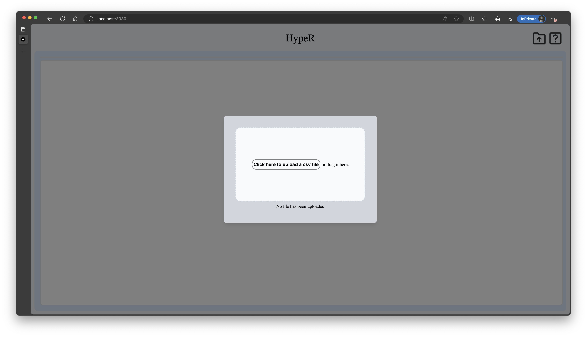

# Website v.2.0 Usage

### See also
[Development Documentation](https://github.com/bentondecusin/hyper-frontend/blob/main/DevelopmentDocumentation.md)  

# Intro

This codebase has 2 components: 

- The front end, written in Next.js (an invariant of React.js that does server-side rendering), provides a user interface in the browser and allows the user to:
    - Upload a CSV file as a relational  database
    - Carry out `COUNT` or `AVG` SQL queries.
    - If this SQL is valid, the user can do what-if queries.
    
    The front end uses `port 3030`
    
- The back-end, written in Python,
    - Exposes interfaces to the front end and handles RESTful API call
    - Stores CVS files and
    - Carries out SQL queries
    - Does what-if analyses
    
    The backend uses `port 5000`
    

# Get started

## Install & run front-end

### Requirement

- [n](https://github.com/nvm-sh/nvm)[ode.js and npm](https://docs.npmjs.com/downloading-and-installing-node-js-and-npm)

### Install

```bash
git clone https://github.com/bentondecusin/hyper-frontend.git
cd hyper-frontend
yarn
```

### Run front-end server

```bash
yarn dev
```

If successful, you will be able to see a page like this at [`http://localhost:3030/`](http://localhost:3030/)



## Install & run back-end

### Requirement

- Python 3.9+
- [virtualenv](https://virtualenv.pypa.io/en/latest/installation.html)

### Install the codebase & dependencies

```bash
git clone https://github.com/bentondecusin/Hyper-Code.git
cd Hyper-Code
source ./venv/bin/activate 
pip install -r requirements.txt
```

### Run the backend server

```bash
sh server.sh
```

If successful, you will see this in your terminal


# Upload a csv

When landing the website, you will see this page


Then you can click to upload, or drag a .csv file to the box. If successful, you see a page like this


On your right hand side, you will see a preview of your data frame. Only top 200 record will be shown.


# Run SQL query

Here in the SQL query box, you can run COUNT or AVG query with a single WHERE clause


If the query is valid, you will get a plot.

For example, we run `SELECT COUNT(*) FROM german WHERE credit=1.0` . We’ll get


# Run what-if queries

Here’s the fun part! Now you can update some attribute to some value, and see how it will affect the query result.

For example, after running `SELECT COUNT(*) FROM german WHERE credit=1.0` , we basically asked the dataset: **“How many people have credit that is 1.0 (which means good)”**

And when we run this

 


It is equivalent to asking the dataset: **“How many people have credit that is 1.0 (which means good) if I change status to 2.0 or 0.0?”**

Hitting submit, the plot will give us the answer: **“~800 people will have good credit if you set everyone’s status to 2.0 and ~500 people will have good credit if you set that to 1.0“**


This result is consistent with the results produced in the paper (data here are percentage of the population)

